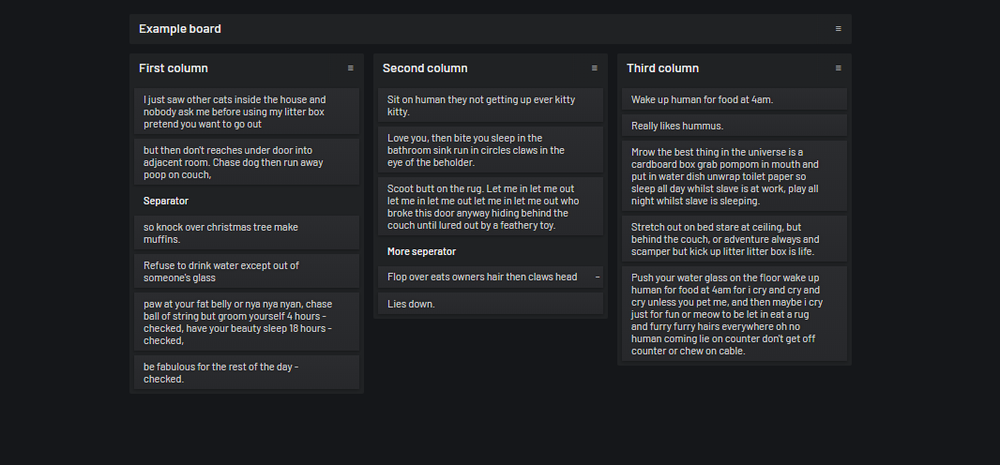

# kanban

A real-time & persistent kanban board.

## Usage

This is meant to be used only by me.

1. One option online at the https://kanban.nitrix.me
2. Another option is locally using `docker run -p 80 -e USERNAME=test -e PASSWORD=test nitrix/kanban`.

It's probably a good idea to mount `/opt/data` where `/opt/data/kanban.db` will reside.

## Feature flags

| Name                | Description                           |
|---------------------|---------------------------------------|
| FEATURE_STAY_LOGGED | Stays logged in via a browser cookie. | 

## Disclaimer

The code was put together in a hurry (less than a day) and is an absolute disaster.

## License

This is free and unencumbered software released into the public domain. See the [UNLICENSE](UNLICENSE) file for more details.